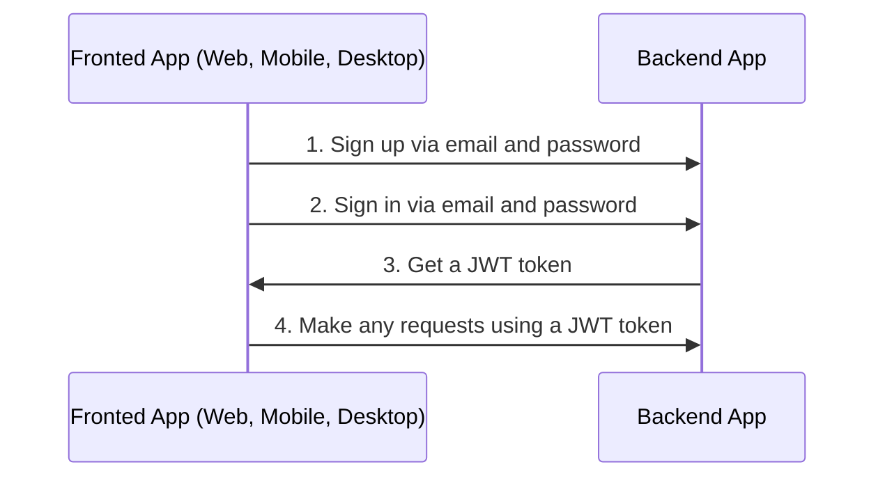
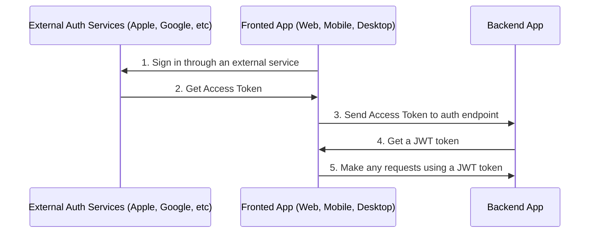

# Auth

By default boilerplate used sign in and sign up via email and password.



Also you can sign up via another external services or social networks like Apple, Facebook, Google, and Twitter.



## Table of Contents

- [Configure Auth](#configure-auth)

---

## Configure Auth

1. Generate secret key

   ```bash
   node -e "console.log(require('crypto').randomBytes(256).toString('base64'));"
   ```

1. Go to `/.env` and change value in `AUTH_JWT_SECRET`

   ```text
   AUTH_JWT_SECRET=HERE_SECRET_KEY_FROM_STEP_1
   ```

Next: [Serialization](serialization.md)

GitHub: https://github.com/slingui-dev/server-side
